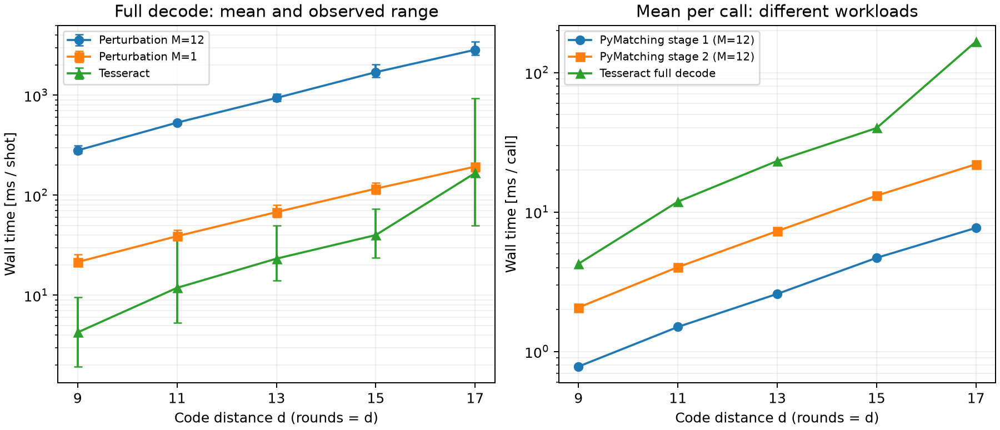

# デコーダー時間の符号距離スケーリング（2026-09-28）

各距離で同じ10 shotをperturbation M=12、M=1、Tesseractに渡した実測。既存100-shotの測定とは別の新しい測定で、混合・平均化していない。

## 条件と測定方法

- 距離 d=9,11,13,15,17。rounds=d。tri / tri_optimal / Z memory。
- NoiseModel.uniform_circuit_noise(0.001)。configs/main.yamlの条件から距離と測定shot数を拡張。設定ファイル自体は未変更。
- perturbation: alpha=1、seed=20260927、original_dem採点、remove_non_edge_like_errors=True。stage 2も摂動priorを使用する既定値。M=1は摂動なしの基準メンバーのみ。
- Tesseract: pqlimit=1000000、det_beam=20、beam_climbing=True、no_revisit_dets=True、num_det_orders=21、det_order_method=Index、seed=2384753、sparsify_errors=False。
- 測定用Stim seed=20260927。別seed=20260928の10 shotでウォームアップ。その後にラッパー有無の出力一致を確認する1 shotを実行し、いずれも統計から除外。
- 各decodeは1 shotずつ。デコーダーの測定順をshotごとに循環。単一プロセスで逐次実行。perturbationはfull_output=True。
- perf_counter_nsによる実時間。回路生成、サンプリング、ウォームアップを測定10 shotのdecode全体から除外。初期化時間は別表。
- 実行中だけPython/C++公開APIに計測ラッパーを付けた。グラフ、探索、候補処理の実装を変更していない。全体時間には計測ラッパーの費用を含む。

## Decode全体：平均・最小・最大

単位はms/shot。最小・最大は今回の10 shot内の観測値。

| d | decoder | 平均 | 最小 | 最大 | 中央値 |
| --- | --- | --- | --- | --- | --- |
| 9 | perturbation_M12 | 281.019 | 260.865 | 313.540 | 279.370 |
| 9 | perturbation_M1 | 21.503 | 19.485 | 25.491 | 20.926 |
| 9 | tesseract | 4.255 | 1.939 | 9.501 | 3.644 |
| 11 | perturbation_M12 | 531.978 | 513.280 | 549.521 | 533.273 |
| 11 | perturbation_M1 | 38.958 | 35.875 | 44.830 | 38.033 |
| 11 | tesseract | 11.860 | 5.304 | 37.109 | 9.015 |
| 13 | perturbation_M12 | 939.341 | 878.356 | 1026.401 | 930.939 |
| 13 | perturbation_M1 | 67.798 | 60.454 | 80.202 | 67.805 |
| 13 | tesseract | 23.218 | 14.111 | 49.667 | 20.544 |
| 15 | perturbation_M12 | 1700.680 | 1518.067 | 2029.119 | 1689.229 |
| 15 | perturbation_M1 | 116.350 | 103.759 | 133.702 | 110.556 |
| 15 | tesseract | 39.974 | 23.669 | 72.676 | 37.260 |
| 17 | perturbation_M12 | 2846.076 | 2538.435 | 3442.211 | 2770.114 |
| 17 | perturbation_M1 | 193.236 | 172.505 | 209.418 | 194.634 |
| 17 | tesseract | 166.756 | 49.471 | 931.803 | 78.216 |

d=17のTesseractは中央値78.216 msに対し最大931.803 msで、平均166.756 msはその長い1 shotの影響を受けている。平均の曲線と中央値・範囲を併せて見る必要がある。

左はdecode全体、右はM=12内のPyMatching 1呼び出しあたり平均とTesseract全体。縦軸は対数。点は平均、左のエラーバーは10 shotの最小〜最大であり信頼区間ではない。右の処理は互いに異なる問題を解くため、同条件でのアルゴリズム比較ではない。

## Perturbationの平均内訳

単位はms/shot。matchingはMatching.decode_batchの呼び出し時間で、C++内部準備・訂正復元を含む。graphはMatching.from_check_matrixの呼び出し時間。candidateは評価器初期化と候補変換・採点。残りは配列処理、結果生成、解放など未分離の処理。

全体 = matching(stage 1 + stage 2) + graph構築 + candidate + 残り。各項目の平均・最小・最大はsummary.csvに収録。

| d | decoder | matching S1 | matching S2 | graph構築 | candidate | 残り | matching以外合計 | 全体 |
| --- | --- | --- | --- | --- | --- | --- | --- | --- |
| 9 | perturbation_M12 | 28.085 | 74.388 | 69.568 | 33.537 | 75.440 | 178.546 | 281.019 |
| 9 | perturbation_M1 | 2.281 | 5.705 | 5.393 | 1.450 | 6.675 | 13.518 | 21.503 |
| 11 | perturbation_M12 | 53.986 | 144.889 | 125.168 | 64.516 | 143.418 | 333.103 | 531.978 |
| 11 | perturbation_M1 | 4.335 | 11.018 | 9.293 | 2.820 | 11.492 | 23.605 | 38.958 |
| 13 | perturbation_M12 | 93.142 | 262.602 | 211.737 | 108.034 | 263.826 | 583.597 | 939.341 |
| 13 | perturbation_M1 | 7.564 | 19.190 | 15.221 | 4.887 | 20.936 | 41.044 | 67.798 |
| 15 | perturbation_M12 | 168.855 | 471.349 | 372.733 | 195.821 | 491.922 | 1060.476 | 1700.680 |
| 15 | perturbation_M1 | 12.968 | 32.548 | 24.767 | 8.684 | 37.383 | 70.834 | 116.350 |
| 17 | perturbation_M12 | 276.982 | 792.319 | 611.988 | 307.832 | 856.955 | 1776.774 | 2846.076 |
| 17 | perturbation_M1 | 21.754 | 52.462 | 40.508 | 14.353 | 64.158 | 119.020 | 193.236 |

## Matching合計とC++側時間

単位はms/shot。nativeはMatchingGraph.decode_batchのPython/C++呼び出し境界で測った値で、型変換も含むmatchingの内数。純粋なMWPM探索だけを分離した値ではない。nativeをmatchingに足してはいけない。

| d | decoder | matching平均 | matching最小 | matching最大 | native S1平均 | native S2平均 | native合計平均 |
| --- | --- | --- | --- | --- | --- | --- | --- |
| 9 | perturbation_M12 | 102.473 | 95.585 | 114.671 | 27.858 | 74.123 | 101.981 |
| 9 | perturbation_M1 | 7.985 | 7.232 | 9.538 | 2.261 | 5.685 | 7.945 |
| 11 | perturbation_M12 | 198.875 | 190.858 | 206.072 | 53.717 | 144.575 | 198.293 |
| 11 | perturbation_M1 | 15.353 | 13.718 | 18.175 | 4.316 | 10.990 | 15.306 |
| 13 | perturbation_M12 | 355.744 | 334.576 | 395.175 | 92.773 | 262.197 | 354.971 |
| 13 | perturbation_M1 | 26.754 | 23.750 | 32.276 | 7.535 | 19.162 | 26.697 |
| 15 | perturbation_M12 | 640.204 | 568.867 | 750.597 | 168.463 | 470.832 | 639.295 |
| 15 | perturbation_M1 | 45.517 | 41.369 | 50.711 | 12.935 | 32.512 | 45.447 |
| 17 | perturbation_M12 | 1069.302 | 953.171 | 1279.816 | 276.529 | 791.746 | 1068.275 |
| 17 | perturbation_M1 | 74.216 | 67.263 | 80.782 | 21.718 | 52.414 | 74.133 |

## PyMatching 1呼び出しあたりの平均

単位はms/call。stageごとの時間をM=12では36回、M=1では3回で割った値。1 shotごとのcall平均の最小・最大はCSVの*_per_call_msに収録し、個別callの最小・最大とは区別する。Tesseractは元DEMのdecode全体なので、同じ問題サイズ・出力仕様のアルゴリズム比較ではない。

| d | decoder | matching S1 | matching S2 | native S1 | native S2 | graph S1 | graph S2 | Tesseract全体 |
| --- | --- | --- | --- | --- | --- | --- | --- | --- |
| 9 | perturbation_M12 | 0.780 | 2.066 | 0.774 | 2.059 | 0.616 | 1.316 | 4.255 |
| 9 | perturbation_M1 | 0.760 | 1.902 | 0.754 | 1.895 | 0.599 | 1.199 | 4.255 |
| 11 | perturbation_M12 | 1.500 | 4.025 | 1.492 | 4.016 | 1.022 | 2.455 | 11.860 |
| 11 | perturbation_M1 | 1.445 | 3.673 | 1.439 | 3.663 | 1.000 | 2.098 | 11.860 |
| 13 | perturbation_M12 | 2.587 | 7.295 | 2.577 | 7.283 | 1.670 | 4.212 | 23.218 |
| 13 | perturbation_M1 | 2.521 | 6.397 | 2.512 | 6.387 | 1.605 | 3.469 | 23.218 |
| 15 | perturbation_M12 | 4.690 | 13.093 | 4.680 | 13.079 | 2.859 | 7.495 | 39.974 |
| 15 | perturbation_M1 | 4.323 | 10.849 | 4.312 | 10.837 | 2.604 | 5.652 | 39.974 |
| 17 | perturbation_M12 | 7.694 | 22.009 | 7.681 | 21.993 | 4.557 | 12.443 | 166.756 |
| 17 | perturbation_M1 | 7.251 | 17.487 | 7.239 | 17.471 | 4.347 | 9.155 | 166.756 |

## 観測されたスケーリング

d=17 / d=9の平均時間比。有限の5点・10 shotでの比率であり、漸近計算量や普遍的な指数を示すものではない。roundsも同時に増えるため、空間距離だけの変化ではない。

| decoder | metric | d=17 / d=9 |
| --- | --- | --- |
| perturbation_M12 | total_ms | 10.128倍 |
| perturbation_M12 | matching_ms | 10.435倍 |
| perturbation_M12 | graph_ms | 8.797倍 |
| perturbation_M12 | candidate_ms | 9.179倍 |
| perturbation_M12 | residual_ms | 11.359倍 |
| perturbation_M1 | total_ms | 8.986倍 |
| perturbation_M1 | matching_ms | 9.294倍 |
| perturbation_M1 | graph_ms | 7.511倍 |
| perturbation_M1 | candidate_ms | 9.899倍 |
| perturbation_M1 | residual_ms | 9.612倍 |
| tesseract | total_ms | 39.192倍 |

Tesseractとperturbationの比較はこの設定での実測値に限る。10 shotの最小・最大は尾部を十分に評価しない。負荷・周波数・測定順などの影響があるため、過去の100-shot値との差をコード変更の効果と解釈しない。

## 初期化・ウォームアップ（秒）

constructionはColorCodeと、Tesseractではcompile_decoderを含む。first decodeはウォームアップ1 shot目で、遅延初期化を含む。warmupはそのfirst decodeを含む10 shotの合計。3列を単純に足してはいけない。

| d | decoder | construction | first decode | warmup 10 shot |
| --- | --- | --- | --- | --- |
| 9 | perturbation_M12 | 0.066903 | 12.416122 | 14.921726 |
| 9 | perturbation_M1 | 0.068188 | 1.324623 | 1.505027 |
| 9 | tesseract | 1.338723 | 0.000173 | 0.023193 |
| 11 | perturbation_M12 | 0.102889 | 23.610727 | 28.422450 |
| 11 | perturbation_M1 | 0.100384 | 2.633744 | 2.980920 |
| 11 | tesseract | 2.439611 | 0.002949 | 0.079550 |
| 13 | perturbation_M12 | 0.136894 | 40.634808 | 49.687598 |
| 13 | perturbation_M1 | 0.174818 | 4.150227 | 4.726997 |
| 13 | tesseract | 3.670700 | 0.011215 | 0.194109 |
| 15 | perturbation_M12 | 0.179517 | 68.123894 | 83.330104 |
| 15 | perturbation_M1 | 0.173992 | 6.155311 | 7.214505 |
| 15 | tesseract | 5.156924 | 0.016984 | 0.489686 |
| 17 | perturbation_M12 | 0.242395 | 97.252695 | 122.363479 |
| 17 | perturbation_M1 | 0.242221 | 8.854153 | 10.581906 |
| 17 | tesseract | 7.565962 | 0.071522 | 0.691033 |

## CSVと検証

- [summary.csv](summary.csv): 全計測項目の平均・最小・最大・中央値。時間列の単位はms。
- [per_shot.csv](per_shot.csv): 150行（5距離×3デコーダー×10 shot）の個別時間。Tesseractに適用しない内訳は空欄。
- [initialization.csv](initialization.csv): 初期化・ウォームアップの15行。時間列の単位は秒。
- 全距離で3デコーダーのStim回路の一致を確認。各perturbationでラッパー有無の予測・候補重みの完全一致を確認。
- 全測定shotでM=12はmatching/graph構築が各72回、候補採点36回。M=1は各6回、候補採点3回。評価器初期化は各1回。
- 全内訳の加算一致と、CSV統計の個別データからの再計算一致を確認。logical_failureは検証用のshot別値で、この標本からLERの優劣は評価しない。
- 計測スクリプト、ラッパー、ログ、作業用JSONは計測終了後に削除。ソースとconfigs/main.yamlは未変更。

## 実行環境・来歴

- 開始: 2026-09-28T21:07:37.076207+09:00
- 終了: 2026-09-28T21:14:51.716001+09:00
- CPU: 13th Gen Intel Core i7-13700H（WSL仮想化環境）。CPU固定や周波数固定は行っていない。
- Python: /home/quantum_teresheys/anaconda3/envs/color_code_so/bin/python
- Python 3.12.14, NumPy 1.26.4, Stim 1.16.0, PyMatching 2.2.dev2, Tesseract 0.1.1.dev20260910235247
- color-code-stim: 072a87d294ed2e9388d1843a1065b41aff043ba4
- PyMatching: 7a26e6a8ef20080e9eab7240ce33581cc3880d03
- workspace base: 332fefca473eee67537084d1071871df099f7c83
- platform: Linux-6.18.33.2-microsoft-standard-WSL2-x86_64-with-glibc2.35
